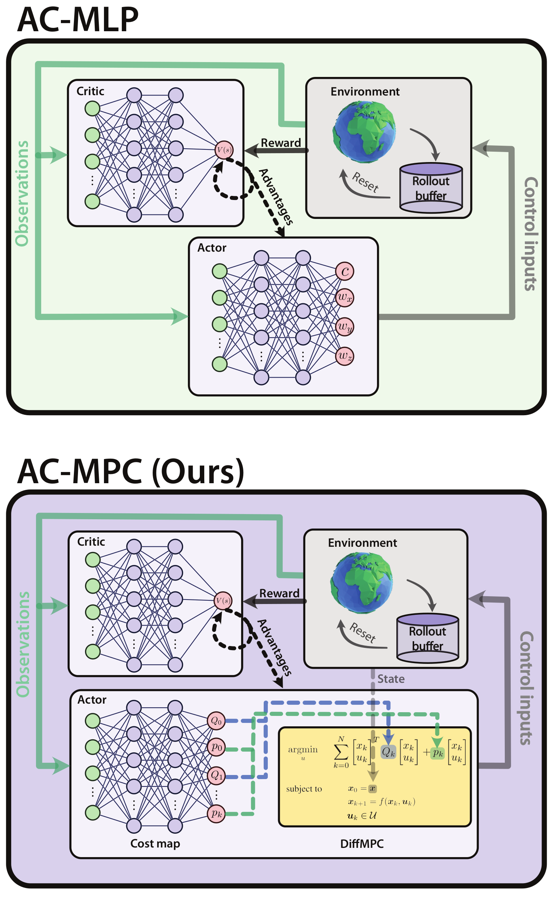
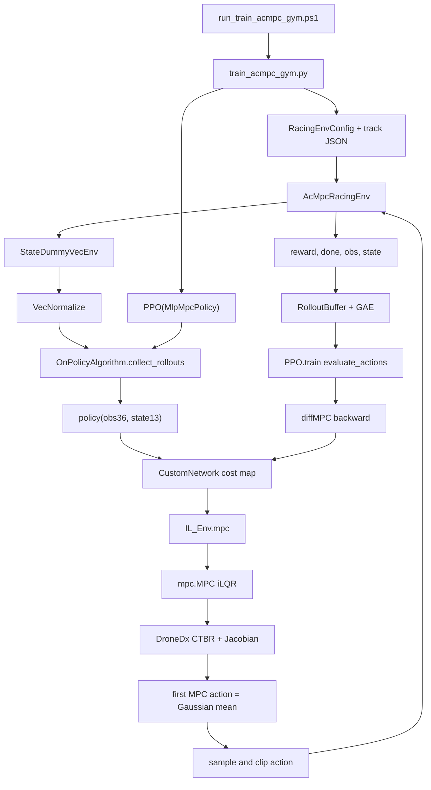
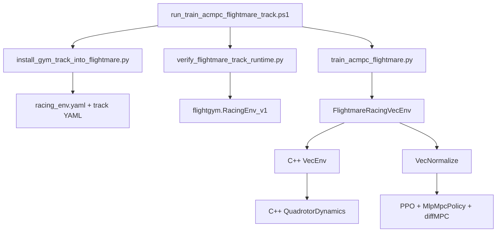
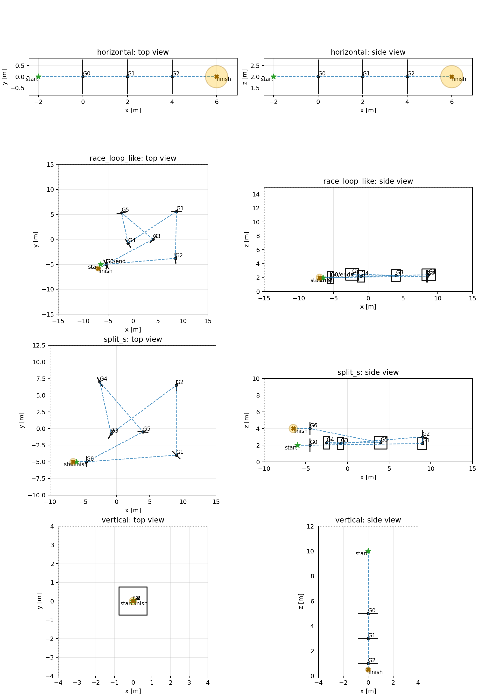

# AC-MPC Agile Quadrotor Racing Reproduction

本仓库是论文 **Actor-Critic Model Predictive Control: Differentiable Optimization meets Reinforcement Learning for Agile Flight** 的仿真技术复现工程。工程以作者公开的 AC-MPC、`mpc.pytorch` 和 Stable-Baselines3 fork 为算法基础，补齐了可训练的 Python Gym 竞速环境、PPO `state` 数据链、MPVE 扩展、修改版 Flightmare `RacingEnv`、Windows headless 编译、赛道同步、训练、评估和可视化工具。

- [论文 PDF](https://rpg.ifi.uzh.ch/docs/TRO25_ACMPC_Romero.pdf)
- [作者原始 AC-MPC 仓库](https://github.com/uzh-rpg/acmpc_public)
- [Flightmare 原始仓库](https://github.com/uzh-rpg/flightmare)
- [本复现仓库](https://github.com/Bill-WangJiLong/AC-MPC_Reproduction)



## 1. 项目定位

本项目的目标是验证并复现 AC-MPC 的完整仿真方法链，而不是逐点复刻论文中的最终数值：

1. 用神经网络根据赛道观测生成随状态变化的 MPC 二次代价；
2. 用可微 MPC 和四旋翼名义模型求出 CTBR 控制序列；
3. 把 MPC 第一拍控制作为高斯策略均值，用 PPO 完成探索和策略更新；
4. 用 Critic 学习长时域价值，用 MPC 负责短时域受约束预测；
5. 先在 Python Gym 环境验证算法，再迁移到 Flightmare C++ 动力学环境；
6. 支持训练、checkpoint、观测归一化、确定性评估、轨迹记录、速度热力图和训练指标绘图；
7. 保留 MPVE、sim-to-real 和更真实动力学的扩展接口。

当前明确不包含：

- AC-MLP、tracking MPC、L1-MPC 等 baseline 复现；
- 作者私有 modified Flightmare 工程的逐行还原；
- BEM/NeuroBEM、真实硬件、延迟、传感器噪声和 domain randomization；
- Unity 门和障碍物场景；
- 对论文赛道尺寸、训练曲线和最终速度的数值级复刻。

因此，本文中的 `split_s`、`race_loop_like` 等赛道是论文启发的技术复现赛道，不应表述为作者原始赛道参数。

## 2. 仓库总体结构

```text
AC-MPC_Reproduction/
├── README.md                     # 本文件，项目总入口
├── .gitignore                    # 排除 runs、构建缓存、平台二进制等
├── .gitattributes                # 统一 Git 文本和二进制处理规则
├── acmpc_public/                 # AC-MPC、PPO、Gym、MPVE、训练和评估
└── flightmare/                   # 修改版 Flightmare 和新增 C++ RacingEnv
```

`acmpc_public/mpc.pytorch`、`acmpc_public/stable-baselines3` 和 `flightmare` 都是包含本地修改的普通源码目录，不是 clone 后仍需更新的 Git 子模块。不要用上游仓库直接覆盖这些目录。

## 3. 论文方法与当前代码的对应关系

### 3.1 Actor-Critic MPC 的核心思想

普通 actor-critic 使用神经网络直接给出策略均值：

```text
observation s_k -> actor neural network -> action mean
```

AC-MPC 把 actor 替换为“神经代价图 + 可微 MPC”：

```text
observation s_k -> neural cost map -> Q(s_k), p(s_k)
physical state x_k + Q,p -> differentiable MPC -> action mean
```

Critic 仍预测标量价值 `V(s_k)`。这种结构让：

- Critic 学习赛道任务的长期回报；
- 神经 cost map 学习如何把长期目标编码为短时域 MPC 代价；
- MPC 使用已知动力学、输入边界和短时预测生成可行控制；
- PPO 通过可微 MPC 的 backward 把策略梯度传回 cost-map 网络。

### 3.2 论文要素到代码的映射

| 论文概念 | 当前实现 | 主要文件 | 状态 |
|---|---|---|---|
| Actor-Critic | SB3 PPO + `MlpMpcPolicy` | `stable-baselines3/`, `training_modules/mlp_mpc_policy.py` | 已实现 |
| Neural cost map | observation 到 `Q,p` 的 MLP | `training_modules/mlp_mpc_policy.py` | 已实现 |
| Differentiable MPC | iLQR/LQR backward | `mpc.pytorch/mpc/` | 已实现 |
| 四旋翼名义模型 | 10 维 CTBR 模型及解析 Jacobian | `diff_mpc_drones/drone.py` | 作者代码 |
| 36 维赛道观测 | `v3 + R9 + gate corners 24` | Gym observation builder、C++ `RacingEnv::getObs()` | 已实现 |
| CTBR 动作 | collective thrust + body rates | Policy、Gym dynamics、Flightmare command | 已实现 |
| 观测归一化 | running mean/std | SB3 `VecNormalize` | 已实现 |
| 论文 gate reward | progress、body-rate penalty、gate/collision/finish | Gym 和 Flightmare reward | 已实现并加入显式终点 |
| 多环境 PPO | Gym `DummyVecEnv`、Flightmare C++ `VecEnv` | wrappers 和 adapters | 已实现 |
| MPVE | MPC 预测上的 critic 监督 | `train_acmpc_gym_mpve.py` | 仅 Gym |
| Modified Flightmare | 自建 headless C++ `RacingEnv` | `flightmare/flightlib/.../racing_env` | 技术复现，不是作者私有版本 |
| NeuroBEM/sim-to-real | 未接入 | 预留参数与环境边界 | 未实现 |

### 3.3 论文描述与公开代码存在的差异

必须区分论文文字和作者公开实现：

| 项目 | 论文描述 | 当前保留的公开代码行为 |
|---|---|---|
| cost-map 隐藏层 | 两层 512、ReLU | 三层 512、GELU |
| Critic 隐藏层 | 两层 512、ReLU | 两层 512、GELU，随后接 SB3 value head |
| cost map 输出 | `2T(n_state+n_input)` | `28T`，其中 `n_state=10`、`n_input=4` |
| Q | 对角、带正下界 | Sigmoid 映射到约 `[0.1, 100000.1]` |
| p | 有界线性项 | 大部分映射到约 `[-50000, 50000]`，thrust 项单独缩放 |
| MPC horizon | 实验中存在不同 `N/T` | 由环境变量 `ACMPC_T` 控制，当前训练默认 `T=2` |
| observation normalization | 每轮根据均值和标准差归一化 | `VecNormalize` 按数据流持续更新 running mean/std |

本复现优先保持作者公开代码的可运行行为，并在文档中明确差异，没有为了看起来更像论文文字而静默改写网络。

## 4. 数据合同和维度

### 4.1 Observation: 36 维

Policy 和 Critic 接收的 observation 为：

```text
o_quad  = [linear_velocity(3), rotation_matrix_row_major(9)] = 12
o_track = [next_gate_corners(12), second_gate_corners(12)]   = 24
observation                                                   = 36
```

每扇门的四个角点各有三维坐标，因此一扇门贡献 `4 x 3 = 12` 维。支持两种第二门表达：

- `vehicle_relative`: 两扇门角点都减当前无人机位置，当前默认；
- `chained_gate_relative`: 第一门相对无人机，第二门角点减第一门对应角点。

环境输出原始物理量。`VecNormalize` 只归一化送进神经网络的 observation，不改变环境状态和物理动力学。

### 4.2 State side-channel: 13 维

PPO 之外额外传递：

```text
state13 = [position(3), quaternion_wxyz(4), velocity(3), body_rate(3)]
```

这 13 维不是 observation 的重复版本，而是 MPC actor 的物理初态 side-channel：

- Critic 只使用 36 维 observation；
- cost-map 网络只使用 36 维 observation；
- MPC 只取 `state13[:, 0:10] = [p,q,v]`；
- 外部环境仍保存 `omega(3)`，所以统一状态接口为 13 维；
- 13 维 state 不经过 `VecNormalize`。

### 4.3 MPC 内部状态和输入

内部 CTBR 模型使用：

```text
x = [position(3), quaternion(4), velocity(3)]       # 10
u = [collective_thrust_N(1), body_rate_xyz(3)]      # 4
tau = [x,u]                                          # 14
```

body rate 在内部 MPC 中是控制输入，不是状态，因此内部状态是 10 维而不是 13 维。

### 4.4 Action: 4 维归一化 CTBR

Policy 对环境输出：

```text
action = [normalized collective thrust, normalized wx, wy, wz]
action_space = Box(-1, 1, shape=(4,))
```

环境反归一化为：

```text
mass_normalized_thrust = action[0] * force_std + force_mean
collective_thrust_N = mass * mass_normalized_thrust
body_rate_cmd = action[1:4] * [10, 10, 4] rad/s
```

`force_mean = force_std = (4 * 8.5 / mass) / 2`。因此第一维 `-1` 对应零总推力，`+1` 对应四电机最大总推力。

## 5. Neural Cost Map 和 MPC 代价

### 5.1 网络输出

`MlpMpcPolicy` 中的 `CustomNetwork.policy_net` 接收 36 维归一化 observation，输出：

```text
28T = T * (14 Q-diagonal coefficients + 14 p coefficients)
```

对每个 horizon step，14 维组合顺序为：

```text
[position(3), quaternion(4), velocity(3), thrust(1), body_rate(3)]
```

二次代价由 `QuadCost(Q,p)` 表示，形式可理解为：

```text
0.5 * tau^T Q tau + p^T tau
```

Q 采用对角形式以减少学习参数量，并通过 Sigmoid 映射和 `epsilon=0.1` 保持正下界。p 提供有符号线性项，使网络可以学习目标位置、姿态、速度和控制偏好。

### 5.2 MPC 求解

`IL_Env.mpc()` 构造：

- horizon `T`；
- 10 维状态、4 维控制；
- 总推力边界 `[0, 4*8.5] N`；
- body-rate 边界 `[-10,10]`、`[-10,10]`、`[-4,4] rad/s`；
- 悬停推力初始化序列；
- `GradMethods.ANALYTIC`，使用 `DroneDx` 解析 Jacobian；
- 当前 policy 每次设置 `lqr_iter_override=1`。

求解器输出完整预测：

```text
nom_x: [batch, T, 10]
nom_u: [batch, T, 4]
self.predictions: [batch, T, 14]
```

策略只执行 `nom_u[:, 0, :]`，下一仿真步重新观察、重新构造代价并重新求解，这就是 receding-horizon MPC。

### 5.3 可微性和梯度边界

训练采样阶段位于 `torch.no_grad()`：

- MPC 仍前向求解；
- `backprop=False` 让求解器提前返回 detach 结果；
- 不保留无用 autograd graph，降低显存增长。

PPO 更新阶段调用 `evaluate_actions()`：

- 使用 buffer 中相同的 observation、state 和 action；
- 重新运行 cost map 和 MPC；
- `torch.is_grad_enabled()` 为真，因此 `backprop=True`；
- PPO policy loss 对 MPC 输出均值求导；
- 梯度通过 differentiable MPC backward 到 cost-map 网络；
- `DroneDx` 和 MPC 求解器没有需要学习的网络参数，因此 optimizer 实际更新 cost map、Critic 和 `log_std`。

## 6. PPO 训练机制

### 6.1 探索与推理

MPC 第一拍输出是高斯分布均值：

```text
mu(s,x) = normalized first MPC control
a ~ Normal(mu, diag(exp(log_std)^2))
```

- 训练时从高斯分布采样，`log_std` 是 PPO 可训练参数；
- 环境执行裁剪到 `[-1,1]` 的动作；
- 确定性评估时直接使用均值，也就是 MPC 输出，不再采样；
- `distr_identity=True` 表示 MPC 后面没有额外 action MLP。

### 6.2 Rollout 数据

每个样本保存：

```text
observation(36)
state(13)
sampled_action(4)
reward
episode_start/done
old_value
old_log_prob
advantage
return target
```

默认 `n_envs=8`、`n_steps=250`，所以一次 PPO update 收集：

```text
rollout_size = 8 * 250 = 2000 environment transitions
```

默认 `batch_size=2000`、`n_epochs=10`，即同一批固定 rollout 数据在一个 update 中完整重算和优化 10 次。reward、GAE advantage、return 和 old log probability 在这 10 次内固定，当前 policy、value 和 new log probability 每次都会重算。

### 6.3 GAE 和 loss

每个环境 step 都产生一个 reward。rollout 完成后按时间反向计算：

```text
delta_t = r_t + gamma * V(s_{t+1}) - V(s_t)
A_t = delta_t + gamma * gae_lambda * A_{t+1}
return_t = A_t + V_old(s_t)
```

PPO 总 loss：

```text
ratio = exp(log_prob_new - log_prob_old)
policy_loss = -mean(min(A*ratio, A*clip(ratio, 1-eps, 1+eps)))
value_loss = MSE(return, V_new)
entropy_loss = -mean(entropy)
loss = policy_loss + ent_coef*entropy_loss + vf_coef*value_loss
```

默认 `gamma=0.98`、`gae_lambda=0.95`、`clip_range=0.2`、`ent_coef=0.001`、`vf_coef=0.5`、`max_grad_norm=0.5`。

### 6.4 为什么必须补 state plumbing

作者 fork 已在 policy 和 buffer 数据类型中留下 state 结构，但原始 PPO 主流程没有完整传递它。本项目补齐：

```text
env.get_state()
-> OnPolicyAlgorithm.collect_rollouts()
-> policy(obs, state)
-> RolloutBuffer.add(..., state, ...)
-> rollout_data.states
-> PPO.train()
-> policy.evaluate_actions(obs, action, state)
```

没有这条链，MPC actor 无法获得与每个 transition 对齐的物理初态。

## 7. Reward、门和终点

论文 racing reward 在每个仿真 step 计算：

```text
-10                                               if collision
+10                                               if gate passed
+10                                               if race finished
||g_k - p_{k-1}|| - ||g_k - p_k|| - 0.01||omega|| otherwise
```

本项目保持该优先级，并定义同一步通过末门且到达终点时奖励 `+20`。连续项是到当前目标的距离减少量，近似量级可理解为 `v_toward_gate * dt`，但代码始终直接计算两个欧氏距离之差。

### 7.1 Gate 几何

每扇门由：

```text
center, normal, up, width, height, frame_thickness
```

定义。代码正交化 `normal/up` 并计算 `right`，使用连续线段与门平面的交点检测高速穿门，使用 inner/outer rectangle 环带检测门框碰撞，并用 `drone_radius` 缩小有效开口。

### 7.2 Finish 扩展

论文只给出了 race finished 奖励，没有提供本复现赛道的统一终点文件格式。本项目在每条赛道最后一扇门后加入球形 finish region：

```text
finish.position: [x,y,z]
finish.radius: positive scalar
```

只有按顺序通过全部门后才进入 finish phase。使用线段与球的最近点检测，避免高速一步越过终点造成漏判。

### 7.3 Episode 结束条件

- 到达 finish region；
- 当前目标门框碰撞；
- 触地；
- 超出 world bounds；
- state 出现 NaN/Inf；
- 达到最大 episode steps。

`success_rate` 表示完成全部门和终点的 episode 比例，不是单门通过率。`gate_index` 用于观察局部进度。

## 8. 两套外部仿真环境

### 8.1 Python Gym 原型

Gym 环境用于低成本验证接口、reward、gate、PPO 和 MPVE。它包含：

- 13 维刚体状态；
- RK4 积分；
- 2.5 ms 子步、20 ms 控制步；
- body-rate controller；
- X 构型电机 allocation；
- motor lag 和 thrust map；
- 重力、惯性耦合和线性阻力；
- 门、门框、边界、地面和终点。

它比“直接位置积分”的简单 Gym 更接近四旋翼，但不是 Flightmare 的 Python 逐行重写。

### 8.2 修改版 Flightmare RacingEnv

Flightmare 路径使用 C++ `Quadrotor` 和 `QuadrotorDynamics` 推进真实外部状态，并新增：

- `RacingEnv` C++ class；
- 36/4/13 接口；
- gate、frame、finish、collision 和 reward；
- `VecEnv<RacingEnv>` OpenMP 批量执行；
- pybind `flightgym.RacingEnv_v1`；
- Python SB3 `VecEnv` adapter；
- Windows/MSVC headless 构建，不依赖 Unity/OpenCV/ZMQ。

未加入 Unity gate 可视化。训练轨道由 YAML 读取，Gym JSON 是规范源。

### 8.3 内部名义模型与外部模型的关系

内部 MPC 只用于预测和求解；外部环境才决定真实 transition 和 reward。模型不完全一致时，PPO 会学习在外部环境中表现良好的 cost map，这也保留了“名义模型 + 外部系统”结构。

当前参数对比：

| 参数 | MPC 内部 | Gym 外部 | Flightmare 外部 |
|---|---:|---:|---:|
| mass | 0.752 | 0.752 | 0.752 |
| dt | 0.02 | 0.02 | 0.02 |
| inertia diag | 0.0025, 0.0021, 0.0043 | 相同 | 约 0.00815, 0.00815, 0.01268 |
| arm/allocation | `lx=.075, ly=.10` | 0.17 m X | 0.17 m X |
| kappa | 0.022 | 0.016 | 0.016 |
| motor tau | CTBR 模型不显式积分 motor | 0.02 | 0.0001 |
| motor omega max | 不使用 | 3000 | 1700 |
| per-motor thrust cap | 8.5 N | 8.5 N | action 8.5 N，map 上限约 8.596 N |
| body-rate max | 10,10,4 | 10,10,4 | 10,10,4 |
| linear drag | 无 | 0.05,0.05,0.08 | 无 |

这些差异是当前实现事实，不应宣称三个模型参数完全一致。

## 9. MPVE 扩展

Model-Predictive Value Expansion 使用 MPC 已有的预测轨迹为 Critic 增加短时域监督。

`MPVERolloutBuffer` 额外保存：

```text
prediction_observations [batch,H,36]
prediction_rewards      [batch,H]
prediction_valid        [batch,H]
prediction_terminal     [batch,H]
```

Gym 环境的 `compute_prediction_rollout()` 在不修改真实环境状态的情况下，把 `MlpMpcPolicy.predictions = [x10,u4]` 转换为预测 observation、reward 和 mask。训练时：

```text
value_loss = TD(GAE) value MSE + mpve_coef * prediction value MSE
```

当前限制：

- 只实现于 Python Gym；
- 主要额外训练 Critic；
- prediction 已 detach，MPVE loss 不通过预测状态反传进 MPC；
- 没有独立 MPVE lambda，`gae_lambda` 只用于真实 rollout 的 GAE；
- Flightmare 训练脚本目前使用标准 PPO。

## 10. 端到端调用链

### 10.1 Gym 标准 PPO 训练



函数级时序：

1. PowerShell wrapper 验证 track JSON 和 finish；
2. `train_acmpc_gym.py::main()` 设置 `ACMPC_T`、run directory、callbacks 和 PPO 参数；
3. `make_acmpc_racing_vec_env()` 创建多个 Gym env、`StateDummyVecEnv` 和可选 `VecNormalize`；
4. `PPO.learn()` 进入 `OnPolicyAlgorithm.learn()`；
5. `collect_rollouts()` 从 env 取得 observation 和 `get_state()`；
6. `ActorCriticPolicy.forward(obs,state)` 提取特征并调用 `CustomNetwork.forward()`；
7. `forward_actor()` 生成 `Q,p` 并调用 `IL_Env.mpc()`；
8. `mpc.MPC.forward()` 使用 `DroneDx`、解析 Jacobian、box constraints 和 iLQR 求解；
9. MPC 第一拍归一化后成为 Gaussian mean，policy 采样动作；
10. `AcMpcRacingEnv.step()` 反归一化动作并推进外部动力学；
11. transition 写入带 13 维 state 的 `RolloutBuffer`；
12. rollout 结束后计算 GAE/returns；
13. `PPO.train()` 对 buffer 做 `n_epochs` 轮更新；
14. `evaluate_actions(obs,action,state)` 重算可微 MPC，`loss.backward()` 更新 cost map、Critic 和 exploration std；
15. callback 保存 CSV、TensorBoard、checkpoint、`final_model.zip` 和 `vecnormalize.pkl`。

### 10.2 Flightmare PPO 训练



与 Gym 的 PPO/Policy/MPC 链完全相同，区别只在外部环境：

```text
Gym:       AcMpcRacingEnv -> Python dynamics
Flightmare: FlightmareRacingVecEnv -> pybind -> VecEnv<RacingEnv> -> C++ dynamics
```

### 10.3 评估调用链

```text
run_eval_*.ps1
-> eval_acmpc_*.py
-> load final/checkpoint model
-> load matching vecnormalize.pkl and set training=False
-> deterministic policy.predict(...)
-> environment step and trajectory recording
-> summary.json / episode_metrics.csv / trajectories.npz
-> plot_trajectories.py
-> trajectory + gate + speed heatmap + control statistics
```

模型、`vecnormalize.pkl`、`ACMPC_T`、赛道和 action/state 合同必须匹配。

## 11. 根目录文件说明

| 路径 | 作用 |
|---|---|
| `README.md` | 项目原理、实现、文件清单、调用链和使用入口 |
| `.gitignore` | 排除训练输出、缓存、`.pyd`、CMake 构建目录和临时文件 |
| `.gitattributes` | 配置文本换行和二进制文件属性 |
| `acmpc_public/` | AC-MPC 算法、Gym、PPO、MPVE、Python Flightmare adapter 和工具 |
| `flightmare/` | 修改后的 Flightmare C++ 源码、配置和 pybind |

## 12. `acmpc_public` 文件和目录说明

### 12.1 顶层文件

| 文件 | 作用 |
|---|---|
| `acmpc_public/README.md` | 作者原始 AC-MPC 项目简介、论文和 citation |
| `acmpc_public/LICENSE` | AC-MPC 仓库许可证 |
| `acmpc_public/.gitignore` | 原工作区忽略规则，包含 `runs/` |
| `acmpc_public/.gitmodules` | 作者原仓库的历史子模块声明；组合仓库已把源码作为普通目录提交 |
| `acmpc_public/img/acmpc_structure.png` | 论文 AC-MPC 架构图 |

### 12.2 `training_modules/`

| 文件 | 作用 |
|---|---|
| `mlp_mpc_policy.py` | 主 AC-MPC policy；36 维 cost map、Critic、Q/p 构造、diffMPC 调用、动作归一化、prediction 缓存 |
| `mlp_only_policy.py` | 作者 AC-MLP policy；baseline 代码，本复现主实验不使用 |

`mlp_mpc_policy.py` 是算法入口。项目修改包括可靠定位 `diff_mpc_drones`、按 grad mode 控制 MPC backward、detach `u_prev` 防止保留旧图，以及补充数据维度说明。当前 `IL_Env` 会覆盖传入 `u_init`，所以 `u_prev` 尚未形成有效跨调用 warm start。

### 12.3 `diff_mpc_drones/`

| 文件 | 作用 |
|---|---|
| `drone.py` | 作者 10 维 CTBR 四旋翼模型、四元数运算、非线性离散动力学、解析 A/B Jacobian、输入边界和参数 |
| `il_env.py` | 把 `DroneDx`、`QuadCost`、box constraints 和 `mpc.MPC` 组装为 policy 可调用的 MPC wrapper |

`drone.py` 当前保持作者实现。`il_env.py` 新增 `backprop` 透传，以区分 rollout/inference 和 PPO update。

### 12.4 `acmpc_racing_gym/`

#### 包入口和配置

| 文件 | 作用 |
|---|---|
| `__init__.py` | 导出 `AcMpcRacingEnv` 和 `RacingEnvConfig` |
| `config.py` | `InitialStateConfig`、`RacingEnvConfig`、边界、seed、环境组件配置 |

#### `dynamics/`

| 文件 | 作用 |
|---|---|
| `dynamics/__init__.py` | 导出动力学、参数和状态对象 |
| `dynamics/params.py` | 质量、重力、dt、子步、惯量、臂长、kappa、rate gain、motor tau、thrust map、drag 和动作限制 |
| `dynamics/state.py` | `QuadrotorState`、13 维转换、四元数归一化/乘法/旋转矩阵/yaw 初始化 |
| `dynamics/integrator.py` | 通用固定步长 RK4 `k1..k4` 积分 |
| `dynamics/flightmare_like_dynamics.py` | CTBR 反归一化、rate controller、allocation、motor lag、thrust map、刚体微分和子步推进 |

#### `observations/` 和 `rewards/`

| 文件 | 作用 |
|---|---|
| `observations/__init__.py` | 导出 observation builder 和模式 |
| `observations/acmpc_observation.py` | 构造并校验论文式 36 维 observation，支持两种第二门表达 |
| `rewards/__init__.py` | 导出 reward 类和配置 |
| `rewards/racing_reward.py` | 实现 collision/gate/finish/progress/body-rate reward 分支 |

#### `tracks/`

| 文件 | 作用 |
|---|---|
| `tracks/__init__.py` | 导出 Gate、Track、FinishRegion 和 loader |
| `tracks/gate.py` | 门坐标系、角点、线段平面交点、正向穿门和门框碰撞 |
| `tracks/track.py` | 起点、终点球、当前门索引、future gates、finish phase 和目标位置 |
| `tracks/loader.py` | 从 UTF-8 JSON 加载并验证赛道 |
| `tracks/assets/horizontal.json` | 三门水平赛道和终点 |
| `tracks/assets/vertical.json` | 从 z=10 向下穿三门的垂直赛道和终点 |
| `tracks/assets/split_s.json` | 七门 Split-S-inspired 赛道 |
| `tracks/assets/race_loop_like.json` | 七门 loop-like 赛道，约 `+-15` 边界 |

Gym JSON 是赛道规范源。新增或修改赛道后，用安装脚本生成 Flightmare YAML。

#### `envs/`

| 文件 | 作用 |
|---|---|
| `envs/__init__.py` | 导出 Gym 环境 |
| `envs/racing_env.py` | 组装 track、dynamics、observation、reward；实现 Gym `reset/step`、collision、finish、state side-channel 和 MPVE prediction rollout |

#### `wrappers/`

| 文件 | 作用 |
|---|---|
| `wrappers/__init__.py` | 导出 state-aware VecEnv 和 factory |
| `wrappers/state_vec_env.py` | 继承 SB3 `DummyVecEnv`，将子环境 state 堆叠为 `[n_envs,13]` |
| `wrappers/sb3_make_env.py` | 创建 env factories、`StateDummyVecEnv` 和可选 `VecNormalize` |

### 12.5 `acmpc_flightmare/`

| 文件 | 作用 |
|---|---|
| `__init__.py` | 导出 Flightmare VecEnv、factory 和 track metadata 工具 |
| `track.py` | 加载 `racing_env.yaml` 和嵌套 track YAML；计算 gate frame/corners；为评估提供统一 metadata；无 PyYAML 时使用受限 fallback parser |
| `vec_env.py` | 把 `flightgym.RacingEnv_v1` 适配为 SB3 `VecEnv`，管理 obs/state/reward/done/extra-info buffer 和 `VecNormalize` |

### 12.6 `scripts/`

完整参数和输入输出见 [`acmpc_public/scripts/README_zh.md`](acmpc_public/scripts/README_zh.md)。当前所有脚本如下：

| 文件 | 作用 |
|---|---|
| `README_zh.md` | 27 个可执行脚本的详细使用说明 |
| `smoke_test_acmpc_forward.py` | 验证 import、DroneDx、MPC、Policy 初始化和单次前向 |
| `validate_acmpc_core.py` | 验证动力学、四元数、解析 Jacobian、MPC bounds、batch 1/8/64 和 prediction shape |
| `smoke_test_racing_gym.py` | 回归测试 Gym gate/frame/bounds/finish/normalization/state plumbing 和 policy |
| `train_acmpc_gym.py` | 标准 Gym PPO 训练、run config、CSV/TensorBoard、checkpoint、CUDA memory log 和 normalizer 保存 |
| `run_train_acmpc_gym.ps1` | Gym 通用训练入口；先校验 JSON、gate 和 finish，再调用 Python |
| `eval_acmpc_gym.py` | 加载 Gym 模型/normalizer，固定 seed 评估并记录指标和轨迹 |
| `run_eval_acmpc_gym.ps1` | Gym 评估 PowerShell 入口 |
| `train_acmpc_gym_mpve.py` | `MPVERolloutBuffer`、MPVE target 和 PPO+MPVE 训练 |
| `run_mpve_horizontal_pipeline.ps1` | 水平赛道 MPVE 训练、评估和绘图流水线 |
| `build_flightmare_racing_env.ps1` | 解析 VS/CMake/Conda，headless editable 编译 `flightgym` |
| `smoke_test_flightmare_racing_env.py` | 验证 pybind import、36/4/13、reset/getState/step 和 finite 输出 |
| `run_smoke_test_flightmare_racing_env.ps1` | Flightmare smoke PowerShell 入口 |
| `install_gym_track_into_flightmare.py` | JSON 到 YAML 转换，更新 runtime `track_path`，支持备份恢复 |
| `verify_flightmare_track_runtime.py` | 实例化真实 C++ env，核对赛道和接口 |
| `train_acmpc_flightmare.py` | Flightmare PPO 训练、checkpoint、日志、normalizer 和 CUDA memory 记录 |
| `run_train_acmpc_flightmare.ps1` | 已安装 Flightmare track 的训练参数封装 |
| `run_train_acmpc_flightmare_track.ps1` | 通用“安装赛道 -> runtime 验证 -> 训练”入口 |
| `eval_acmpc_flightmare.py` | Flightmare 确定性/随机评估、metrics、trajectory 和可选绘图 |
| `run_eval_acmpc_flightmare.ps1` | Flightmare 评估 PowerShell 入口 |
| `plot_training_metrics.py` | 绘制 return、success、collision、gate progress、PPO loss、std、learning rate 和 CUDA memory |
| `run_plot_training_metrics.ps1` | Windows 通用训练指标绘图入口 |
| `run_plot_training_metrics.sh` | Bash/Git Bash 训练指标绘图入口 |
| `run_plot_flightmare_training_metrics.ps1` | Flightmare run 指标绘图封装 |
| `plot_gym_tracks.py` | 从 JSON 绘制单轨道和全轨道 2D/3D gate 布局 |
| `plot_trajectories.py` | 绘制 gate、轨迹、速度热力图、终止状态、平均控制和控制标准差 |
| `run_plot_trajectories.ps1` | Gym trajectory 绘图入口 |
| `run_plot_flightmare_trajectories.ps1` | Flightmare trajectory 绘图入口 |

### 12.7 `docs/`

| 文件 | 作用 |
|---|---|
| `acmpc_complete_implementation_change_record_zh.md` | 相对作者基线的完整实现与变更审计 |
| `acmpc_cross_device_migration_guide_zh.md` | clone、Conda、依赖、Flightmare 重编译和迁移验收 |
| `acmpc_environment_status.md` | Python/PyTorch/CUDA 和核心 smoke 状态记录 |
| `acmpc_python_gym_design_zh.md` | Gym 环境接口、动力学、observation、reward、track 和测试设计 |
| `acmpc_reproduction_plan_zh.md` | 分阶段复现纲领，包括 MPVE 和 Flightmare 阶段 |
| `acmpc_vertical_task_investigation_zh.md` | 垂直任务零推力局部最优、动力学和探索方向 |
| `acmpc_weekly_report_20260626.md` | Gym/MPVE/Flightmare 阶段周报 |
| `flightmare_build_prerequisites_zh.md` | Windows 编译前软件、工具链和作用 |
| `flightmare_compile_record_zh.md` | 实际 Flightmare 编译过程、问题和处理记录 |
| `flightmare_racing_env_design_zh.md` | C++ RacingEnv、pybind、配置和接口设计 |
| `flightmare_training_scripts_design_zh.md` | Flightmare 训练、评估和绘图脚本设计 |
| `gym_flightmare_track_workflow_zh.md` | 新增赛道并同步到 Gym/Flightmare 的统一流程 |
| `report_assets/.../metrics_summary.json` | 周报使用的指标摘要 |
| `report_assets/.../split_s_track_layout.png` | 周报使用的 Split-S 赛道图 |

### 12.8 `track_visualizations/`

这些 PNG 是静态展示资产，不参与训练：

| 文件 | 内容 |
|---|---|
| `all_tracks_overview.png` | 当前赛道总览 |
| `horizontal_gates.png` | 水平赛道 |
| `vertical_gates.png` | 垂直赛道 |
| `split_s_gates.png` | 当前 Split-S 赛道 |
| `race_loop_like_gates.png` | loop-like 赛道 |
| `split_s_like_gates.png` | 早期 Split-S-like 展示图，当前无同名训练 JSON |



## 13. `mpc.pytorch` 文件说明

这是 locuslab differentiable MPC 的 vendored 源码。主调用路径是 `mpc.py -> lqr_step.py/pnqp.py -> dynamics/util`。

### 13.1 核心 package

| 文件 | 作用 |
|---|---|
| `mpc/__init__.py` | 导出 MPC package API |
| `mpc/mpc.py` | MPC/iLQR 主循环、线性化、line search、box constraints、可微 backward 包装；本项目增加 `backprop=False` 提前 detach 返回 |
| `mpc/lqr_step.py` | 单次 LQR forward/backward recursion 和控制更新 |
| `mpc/pnqp.py` | projected Newton QP，用于 box-constrained control 子问题 |
| `mpc/dynamics.py` | dynamics 抽象、自动微分/近似 Jacobian 支持 |
| `mpc/torch_numdiff.py` | PyTorch 数值微分工具 |
| `mpc/util.py` | batch 矩阵、轨迹、cost 和索引辅助函数 |
| `mpc/env_dx/__init__.py` | 示例 dynamics package 入口 |
| `mpc/env_dx/cartpole.py` | cart-pole 示例模型 |
| `mpc/env_dx/pendulum.py` | pendulum 示例模型 |
| `mpc/env_dx/control.py` | 示例控制环境公共逻辑 |

### 13.2 包装、示例和测试

| 文件/目录 | 作用 |
|---|---|
| `setup.py` | editable package 安装入口 |
| `README.md` | 上游 solver 用法 |
| `LICENSE.mit` | 上游许可证 |
| `.travis.yml` | 上游 CI 配置 |
| `.gitignore` | 上游忽略规则 |
| `examples/Cartpole Control.ipynb` | cart-pole differentiable MPC notebook |
| `examples/Pendulum Control.ipynb` | pendulum differentiable MPC notebook |
| `examples/Time Varying Linear-Quadratic Control.ipynb` | time-varying LQR notebook |
| `examples/gym_pendulum.py` | 精确 dynamics pendulum 示例 |
| `examples/gym_pendulum_approximate.py` | 近似 dynamics pendulum 示例 |
| `tests/test_dynamics.py` | dynamics/Jacobian 测试 |
| `tests/test_mpc.py` | solver 前向和梯度测试 |

当前 PyTorch 2.6 会对上游 `torch.lu`、`lu_solve` 和 uint8 indexing 发出 deprecation warning，不等于训练报错。

## 14. `stable-baselines3` 文件说明

这是作者 fork 的 SB3 1.7.0a1，依赖 Gym 0.21。AC-MPC 主路径只使用 PPO，但其余上游算法源码仍保留。

### 14.1 AC-MPC 直接相关文件

| 文件 | 作用 |
|---|---|
| `stable_baselines3/common/base_class.py` | algorithm 初始化、env wrapping、learn setup、保存加载；本项目兼容 `reset()->obs` 后 `get_state()` |
| `stable_baselines3/common/buffers.py` | replay/rollout buffer；本项目按 `state_space` 动态分配 state 并随样本返回 |
| `stable_baselines3/common/on_policy_algorithm.py` | PPO rollout 主循环；本项目读取 state、传 policy、写 buffer |
| `stable_baselines3/common/policies.py` | `ActorCriticPolicy`；作者 fork 已支持 `forward(obs,states)`、`evaluate_actions(...,states)` 和 identity distribution |
| `stable_baselines3/common/type_aliases.py` | rollout sample named tuples，包括 state 字段 |
| `stable_baselines3/ppo/ppo.py` | PPO clipped objective；本项目训练时把 `rollout_data.states` 传回 policy |
| `stable_baselines3/ppo/policies.py` | PPO policy aliases |
| `stable_baselines3/ppo/__init__.py` | 导出 PPO |

### 14.2 `stable_baselines3/common/`

| 文件 | 作用 |
|---|---|
| `__init__.py` | common package 入口 |
| `callbacks.py` | callback 生命周期、checkpoint、eval 和 callback list |
| `distributions.py` | Gaussian、categorical、SDE 分布和 log-prob/entropy |
| `evaluation.py` | 通用 policy evaluation |
| `logger.py` | stdout、CSV、TensorBoard 等 logger |
| `monitor.py` | 单环境 episode monitor |
| `preprocessing.py` | observation preprocess 和 space 检查 |
| `running_mean_std.py` | `VecNormalize` 使用的在线均值/方差 |
| `save_util.py` | zip model 序列化 |
| `torch_layers.py` | feature extractor 和通用 MLP 构造 |
| `utils.py` | schedule、seed、device、explained variance 等 |
| `env_checker.py` | Gym env 合同检查 |
| `env_util.py` | env/VecEnv 创建辅助 |
| `noise.py` | off-policy action noise |
| `off_policy_algorithm.py` | SAC/TD3/DDPG/DQN 公共训练基类，本项目主链不使用 |
| `atari_wrappers.py` | Atari wrapper，本项目不使用 |
| `results_plotter.py` | Monitor 结果读取和绘图 |
| `sb2_compat/rmsprop_tf_like.py` | SB2 兼容 RMSProp |
| `envs/bit_flipping_env.py` | SB3 测试环境 |
| `envs/identity_env.py` | SB3 identity 测试环境 |
| `envs/multi_input_envs.py` | SB3 multi-input 测试环境 |

### 14.3 `common/vec_env/`

| 文件 | 作用 |
|---|---|
| `base_vec_env.py` | SB3 VecEnv/VecEnvWrapper 抽象接口 |
| `dummy_vec_env.py` | 同进程顺序向量环境；Gym state wrapper 的父类 |
| `subproc_vec_env.py` | 多进程向量环境，本项目未用于 diffMPC CUDA 主链 |
| `vec_normalize.py` | observation/reward running normalization 和统计保存加载 |
| `vec_monitor.py` | 向量环境 episode monitor |
| `vec_check_nan.py` | NaN/Inf 检查 wrapper |
| `vec_extract_dict_obs.py` | Dict observation 选择 |
| `vec_frame_stack.py` | frame stacking |
| `stacked_observations.py` | frame stack 数据结构 |
| `vec_transpose.py` | 图像通道转置 |
| `vec_video_recorder.py` | 视频录制 |
| `util.py` | VecEnv space/index 工具 |
| `__init__.py` | 导出 VecEnv classes |

### 14.4 其他保留算法

| 目录 | 文件 | 作用 |
|---|---|---|
| `a2c/` | `a2c.py`, `policies.py`, `__init__.py` | A2C |
| `ddpg/` | `ddpg.py`, `policies.py`, `__init__.py` | DDPG |
| `dqn/` | `dqn.py`, `policies.py`, `__init__.py` | DQN |
| `her/` | `goal_selection_strategy.py`, `her_replay_buffer.py`, `__init__.py` | Hindsight Experience Replay |
| `sac/` | `sac.py`, `policies.py`, `__init__.py` | Soft Actor-Critic |
| `td3/` | `td3.py`, `policies.py`, `__init__.py` | TD3 |
| package root | `__init__.py`, `version.txt`, `py.typed` | 包导出、版本和 typing marker |

这些算法、SB3 自带 `tests/`、`docs/`、Docker/CI 文件保留上游结构，不参与 AC-MPC 训练调用链。它们用于验证 fork 完整性和查阅 SB3 行为，不应删除后再用 PyPI SB3 替代，因为 PyPI 版本没有本项目的 state plumbing。

## 15. `flightmare` 文件和目录说明

### 15.1 Flightmare 顶层

| 文件/目录 | 作用 |
|---|---|
| `README.md` | Flightmare 上游说明 |
| `LICENSE` | Flightmare 许可证 |
| `Dockerfile` | 上游容器构建 |
| `.clang-format` | C++ 格式规则 |
| `.gitignore` | 构建和生成文件忽略规则 |
| `.github/workflows/` | 上游 clang-format 和 C++ test CI |
| `flightlib/` | 核心 C++ dynamics、env、VecEnv、pybind，本项目直接使用 |
| `flightrl/` | Flightmare 原有 PPO2/RL 示例，本项目不使用其 PPO |
| `flightrender/` | ROS/renderer package 元数据，本项目 headless 训练不使用 |
| `flightros/` | ROS camera/planning/pilot/racing 示例，本项目不使用 |
| `docs/` | Flightmare 上游 Sphinx 文档和图片 |

### 15.2 `flightlib` 构建和依赖

| 文件 | 作用 |
|---|---|
| `flightlib/CMakeLists.txt` | 核心构建；本项目增加 MSVC CRT、headless、Unity 可选、OpenMP 和 Windows 编译适配 |
| `flightlib/setup.py` | Python editable build；支持 Windows Release 和 `FLIGHTMARE_CMAKE_ARGS` |
| `flightlib/package.xml` | ROS/catkin package 元数据 |
| `cmake/agilib.cmake` | Agilicious/agilib 查找 |
| `cmake/agilib_download.cmake` | agilib 下载 |
| `cmake/catkin.cmake` | catkin 集成 |
| `cmake/eigen.cmake` | Eigen 查找 |
| `cmake/eigen_download.cmake` | Eigen 下载 |
| `cmake/gtest.cmake` | GoogleTest 查找 |
| `cmake/gtest_download.cmake` | GoogleTest 下载 |
| `cmake/pybind11.cmake` | pybind11 查找和构建 |
| `cmake/pybind11_download.cmake` | 固定 pybind11 `v2.10.4` shallow clone |
| `cmake/yaml.cmake` | yaml-cpp 查找 |
| `cmake/yaml_download.cmake` | yaml-cpp 下载 |

### 15.3 `flightlib/configs/`

| 文件 | 作用 |
|---|---|
| `quadrotor_env.yaml` | Flightmare 原 QuadrotorEnv 配置 |
| `vec_env.yaml` | 原向量环境线程/环境数配置模板 |
| `racing_env.yaml` | 新 RacingEnv runtime 配置：dt、episode、动力学、动作、reward、observation 和 `track_path` |
| `tracks/horizontal.yaml` | 从 Gym JSON 同步的水平赛道 |
| `tracks/vertical.yaml` | 从 Gym JSON 同步的垂直赛道 |
| `tracks/split_s.yaml` | 从 Gym JSON 同步的 Split-S 赛道 |
| `tracks/race_loop_like.yaml` | 从 Gym JSON 同步的 loop-like 赛道 |

只改 YAML/JSON 不需要重编 `.pyd`。跨设备后必须重新运行 track installer，因为 `racing_env.yaml` 中 runtime track path 可能是旧设备绝对路径。

### 15.4 `flightlib/include/flightlib/`

#### 环境接口

| 文件 | 作用 |
|---|---|
| `envs/env_base.hpp` | 单环境抽象；本项目新增 state dimension 和 `getState()` |
| `envs/vec_env.hpp` | OpenMP 向量环境模板；本项目新增批量 state、RacingEnv 实例化和 headless Unity stubs |
| `envs/quadrotor_env/quadrotor_env.hpp` | Flightmare 原四旋翼环境声明；本项目做 headless Unity 解耦 |
| `envs/racing_env/racing_env.hpp` | 新 RacingGate/RacingEnv 声明，固定 36/4/13 合同 |
| `envs/test_env.hpp` | Flightmare 测试环境 |

#### Dynamics、状态和命令

| 文件 | 作用 |
|---|---|
| `dynamics/dynamics_base.hpp` | dynamics 基类 |
| `dynamics/quadrotor_dynamics.hpp` | 四旋翼电机/刚体动力学参数和方程 |
| `common/command.hpp` | command 表示，支持 collective thrust/body rates |
| `common/quad_state.hpp` | Flightmare 四旋翼状态 |
| `common/pend_state.hpp` | 摆状态示例 |
| `common/integrator_base.hpp` | 积分器基类 |
| `common/integrator_euler.hpp` | Euler 积分器 |
| `common/integrator_rk4.hpp` | RK4 积分器 |
| `common/math.hpp` | 数学辅助 |
| `common/types.hpp` | Eigen 类型、Scalar、常量和 aliases |
| `common/parameter_base.hpp` | 参数对象基类 |
| `common/logger.hpp` | C++ logger |
| `common/timer.hpp` | 计时器 |

#### Objects、sensors 和 bridge

| 文件 | 作用 |
|---|---|
| `objects/quadrotor.hpp` | Quadrotor object、state、dynamics 和 command；本项目修正总推力 clamp 并解耦 camera include |
| `objects/object_base.hpp` | 仿真 object 基类 |
| `objects/static_object.hpp` | 静态物体 |
| `objects/static_gate.hpp` | 原静态门 object |
| `objects/dynamic_gate.hpp` | 原动态门 object |
| `objects/unity_camera.hpp` | Unity camera object |
| `sensors/sensor_base.hpp` | sensor 基类 |
| `sensors/imu.hpp` | IMU sensor |
| `sensors/rgb_camera.hpp` | RGB camera，headless build 不编译 |
| `bridges/unity_bridge.hpp` | Unity bridge，headless build 不编译 |
| `bridges/unity_message_types.hpp` | Unity 消息类型；本项目移除无条件 OpenCV include |
| `json/json.hpp` | vendored JSON header |

### 15.5 `flightlib/src/`

每个 `.cpp` 对应上节 header 的实现：

| 文件 | 作用 |
|---|---|
| `envs/racing_env/racing_env.cpp` | 新 RacingEnv 全部实现：YAML、reset、CTBR、step、36 obs、13 state、gate/frame/finish/reward/collision/extra info |
| `envs/vec_env.cpp` | VecEnv reset/step/getState/OpenMP；显式实例化 `VecEnv<RacingEnv>` |
| `envs/env_base.cpp` | EnvBase 基础实现和 state dimension 初始化 |
| `envs/quadrotor_env/quadrotor_env.cpp` | 原 QuadrotorEnv，增加 headless 条件编译 |
| `envs/test_env.cpp` | 测试环境实现 |
| `wrapper/pybind_wrapper.cpp` | 暴露 `QuadrotorEnv_v1` 和新增 `RacingEnv_v1` Python class |
| `dynamics/quadrotor_dynamics.cpp` | 四旋翼 dynamics；本项目在 YAML 更新后重算 motor thrust limits |
| `dynamics/dynamics_base.cpp` | dynamics 基类实现 |
| `objects/quadrotor.cpp` | Quadrotor object 和 command 执行；本项目修正 collective thrust clamp |
| `objects/object_base.cpp` | object 基类实现 |
| `objects/unity_camera.cpp` | Unity camera 实现，headless 不编译 |
| `sensors/sensor_base.cpp` | sensor 基类实现 |
| `sensors/imu.cpp` | IMU 实现 |
| `sensors/rgb_camera.cpp` | RGB camera 实现，headless 不编译 |
| `bridges/unity_bridge.cpp` | Unity 通信实现，headless 不编译 |
| `common/command.cpp` | Command 构造和合法性 |
| `common/quad_state.cpp` | QuadState 操作 |
| `common/pend_state.cpp` | PendState 操作 |
| `common/integrator_base.cpp` | 积分器基类实现 |
| `common/integrator_euler.cpp` | Euler 实现 |
| `common/integrator_rk4.cpp` | RK4 实现 |
| `common/math.cpp` | 数学工具实现 |
| `common/parameter_base.cpp` | 参数基类实现 |
| `common/logger.cpp` | logger 实现 |
| `common/timer.cpp` | timer 实现 |

### 15.6 `flightlib/tests/`

| 文件 | 作用 |
|---|---|
| `tests/dynamics/quadrotor_dynamics.cpp` | C++ dynamics 测试 |
| `tests/objects/quadrotor.cpp` | Quadrotor object 测试 |
| `tests/common/integrators.cpp` | 积分器测试 |
| `tests/common/quad_state.cpp` | 状态测试 |
| `tests/common/eigen.cpp` | Eigen 行为测试 |
| `tests/common/logger.cpp` | logger 测试 |
| `tests/envs/vec_env.cpp` | VecEnv 测试 |
| `tests/envs/quadrotor_env/quadrotor_env.cpp` | 原 QuadrotorEnv 测试 |
| `tests/bridges/unity_bridge.cpp` | Unity bridge 测试，headless 默认关闭 |
| `tests/flightgym/interface.py` | Python binding 接口测试 |

### 15.7 Flightmare 其他保留模块

这些目录来自 Flightmare 上游，不进入本项目主训练链：

| 目录/文件 | 作用 |
|---|---|
| `flightrl/setup.py` | 原 Flightmare RL package 安装 |
| `flightrl/rpg_baselines/ppo/ppo2.py` | Flightmare 原 PPO2 实现，本项目不用它训练 AC-MPC |
| `flightrl/rpg_baselines/ppo/ppo2_test.py` | PPO2 测试 |
| `flightrl/rpg_baselines/common/*.py` | 原分布、policy 和工具 |
| `flightrl/rpg_baselines/envs/*.py` | 原 env/VecEnv wrappers |
| `flightrl/examples/run_drone_control.py` | 原 control 示例 |
| `flightrl/examples/view_reward.py` | 原 reward 查看示例 |
| `flightrl/examples/saved/quadrotor_env.zip` | 上游示例模型 |
| `flightrender/CMakeLists.txt`, `package.xml` | renderer/ROS package 构建元数据 |
| `flightros/include/flightros/` | ROS motion planning 和 pilot headers |
| `flightros/src/` | ROS camera、planning、pilot 和 racing 示例实现 |
| `flightros/launch/` | ROS launch 和 RViz 配置 |
| `flightros/params/default.yaml` | ROS 示例参数 |
| `flightros/dependencies.yaml` | ROS 依赖 |
| `flightros/CMakeLists.txt`, `package.xml` | ROS package 构建元数据 |
| `docs/` | 上游 Sphinx 文档、教程源码、模板、截图和 Flightmare 图片 |

## 16. 训练和评估入口

### 16.1 Clone 和环境

```powershell
git clone https://github.com/Bill-WangJiLong/AC-MPC_Reproduction.git acmpc_reproduction_repo
cd acmpc_reproduction_repo\acmpc_public
```

当前已验证环境的核心约束：

- Windows x64；
- Conda Python 3.10；
- PyTorch 2.6.0 + CUDA 11.8；
- NumPy 1.26.4；
- Gym 0.21.0；
- 本仓库的 SB3 1.7.0a1 fork；
- Visual Studio Build Tools 2022、MSVC x64、Windows SDK、CMake；
- Flightmare `.pyd` 必须在目标设备重新编译。

完整安装见 [`acmpc_cross_device_migration_guide_zh.md`](acmpc_public/docs/acmpc_cross_device_migration_guide_zh.md)。

### 16.2 核心验证

```powershell
conda run -n acmpc python scripts\smoke_test_acmpc_forward.py
conda run -n acmpc python scripts\validate_acmpc_core.py
conda run -n acmpc python scripts\smoke_test_racing_gym.py
```

### 16.3 Gym 训练

```powershell
powershell -NoProfile -ExecutionPolicy Bypass -File .\scripts\run_train_acmpc_gym.ps1 -TrackName horizontal -AcmPcT 2 -TotalTimesteps 200000
```

可用 track：`horizontal`、`vertical`、`split_s`、`race_loop_like`。

### 16.4 Gym 评估和绘图

```powershell
$env:RUN_DIR = "D:\path\to\runs\acmpc_gym\run_name"
powershell -NoProfile -ExecutionPolicy Bypass -File .\scripts\run_eval_acmpc_gym.ps1
powershell -NoProfile -ExecutionPolicy Bypass -File .\scripts\run_plot_training_metrics.ps1 -RunDir $env:RUN_DIR
```

### 16.5 编译 Flightmare

从组合仓库根目录或 `acmpc_public` 目录调用时，显式传 Flightmare path：

```powershell
powershell -NoProfile -ExecutionPolicy Bypass -File .\scripts\build_flightmare_racing_env.ps1 -FlightmarePath ..\flightmare -CondaEnvName acmpc
powershell -NoProfile -ExecutionPolicy Bypass -File .\scripts\run_smoke_test_flightmare_racing_env.ps1 -FlightmarePath ..\flightmare
```

生成的 `flightgym.cp310-win_amd64.pyd` 与 Python ABI、编译器和平台绑定，不提交 Git。

### 16.6 Flightmare 通用赛道训练

```powershell
powershell -NoProfile -ExecutionPolicy Bypass -File .\scripts\run_train_acmpc_flightmare_track.ps1 -TrackName vertical -FlightmarePath ..\flightmare -AcmPcT 2 -TotalTimesteps 2000000
```

该入口自动执行：

```text
Gym JSON validation
-> Flightmare YAML generation/install
-> racing_env.yaml track_path update
-> C++ runtime track verification
-> PPO training
```

新增赛道流程见 [`gym_flightmare_track_workflow_zh.md`](acmpc_public/docs/gym_flightmare_track_workflow_zh.md)。

### 16.7 Flightmare 评估

```powershell
powershell -NoProfile -ExecutionPolicy Bypass -File .\scripts\run_eval_acmpc_flightmare.ps1 -FlightmarePath ..\flightmare -RunDir "D:\path\to\run"
```

## 17. Run 输出和指标

训练 run 典型结构：

```text
runs/acmpc_gym/<timestamp_track_T>/
or
runs/acmpc_flightmare/<timestamp_track_T>/
├── config.json
├── final_model.zip
├── vecnormalize.pkl
├── episode_metrics.csv
├── cuda_memory.csv                  # 启用时
├── checkpoints/
│   ├── *_steps.zip
│   └── *_vecnormalize_*.pkl
├── sb3/
│   └── progress.csv / TensorBoard events
└── plots/
```

评估输出通常包含：

```text
summary.json
episode_metrics.csv
trajectories.npz
trajectory_speed_heatmap.png
trajectory_top_view.png
control_statistics.png
```

主要指标：

- `return`: episode 内每个 simulation step reward 的和；
- `success_rate`: 完成全部门和终点的比例；
- `collision_rate`: 因碰撞结束的比例；
- `timeout_rate`: 因最大步数结束的比例；
- `gate_index`: 已完成门的数量/当前进度；
- `average_velocity`: 轨迹速度均值；
- `lap_time`: 成功 episode 的完成时间；
- `policy_std`: PPO exploration 标准差；
- `approx_kl`, `clip_fraction`, `value_loss`, `explained_variance`: PPO 更新状态；
- CUDA allocated/reserved/peak: 区分活跃 tensor 与 allocator cache。

论文训练曲线中的 step 对应累计 environment transitions，即 SB3 `num_timesteps`。一次向量 step 会增加 `n_envs` 个 steps。

## 18. 已验证内容

- `import mpc`、`import drone`；
- `DroneDx.forward()`、四元数 norm 和解析 Jacobian；
- `IL_Env.mpc()` 和 action bounds；
- `MlpMpcPolicy` batch 1、8、64 forward；
- `self.predictions` shape 和 finite；
- Gym gate pass、frame collision、world bounds、finish、同一步末门+终点；
- 36 observation、4 action、13 state 及 VecNormalize；
- SB3 state 从环境到 buffer 再到 PPO update；
- Gym PPO model/checkpoint/normalizer 保存加载；
- Gym MPVE 训练入口；
- Windows headless Flightmare 编译；
- pybind `RacingEnv_v1.reset/step/getState()`；
- Flightmare PPO 训练和评估；
- 轨迹、速度热力图、平均控制和训练指标绘图。

## 19. 当前已知限制和技术风险

1. **Flightmare terminal state 语义**：C++ VecEnv done 后会自动 reset；extra info 是 reset 前值，但 Python 随后 `getState()` 得到 reset 后 state，`terminal_observation` 也不是严格的 reset 前 observation。这会影响 timeout bootstrap 的严格语义。
2. **MPC warm start 未真正生效**：Policy 保存了 detach 的 `u_prev`，但 `IL_Env.mpc()` 当前重新创建悬停 `u_init`。
3. **内部/外部动力学不完全一致**：尤其 Flightmare inertia、motor tau、drag 和 MPC 名义模型存在差异。
4. **碰撞简化**：只检查当前目标门框、地面、bounds 和 finite state；没有检查所有历史/未来门、完整机体网格和场景障碍物。
5. **Gym render 简化**：`human` 仅打印状态，`rgb_array` 是占位黑图；真实可视化由离线 plotting 完成。
6. **Flightmare MPVE 未实现**：当前 MPVE 依赖 Gym 的 prediction rollout。
7. **作者 modified Flightmare 不公开**：本 C++ RacingEnv 是按论文合同和 Flightmare 原设计构建的复现环境。
8. **赛道非精确原版**：用于验证方法和训练链，不用于声明论文数值复现。
9. **PyTorch deprecation warnings**：作者依赖仍使用 tensor `.T`、`torch.lu/lu_solve` 和 uint8 indexing；PyTorch 2.6 可运行，未来升级需迁移。
10. **显存**：CUDA reserved memory 上升可能是 allocator cache；判断泄漏应同时看 allocated、reserved、peak 和 rollout 边界趋势。项目已提供 `cuda_memory.csv`。

## 20. 维护规则

- 修改 observation 维度或顺序时，同时更新 Gym builder、C++ `getObs()`、spaces、policy、adapter、normalizer 和 smoke tests；
- 修改 state 时，同时更新 Gym/Flightmare `getState()`、SB3 buffer、policy state slice 和测试；
- 修改 action 映射时，同时更新 policy normalization、Gym dynamics、Flightmare `actionToCommand()` 和边界；
- 修改 reward/gate/finish 时，同时更新 Python 与 C++ 实现并运行同一步高速穿越测试；
- Gym JSON 是赛道规范源，Flightmare YAML 由 installer 同步；
- 只改 track JSON/YAML 不需要重编，修改 C++/CMake/setup.py/pybind 必须重编 `.pyd`；
- 模型必须与 `vecnormalize.pkl`、`ACMPC_T`、赛道和代码版本一起归档；
- `runs/` 不进入 Git，训练模型和大型结果应单独存档；
- 不要用 PyPI SB3 或上游 mpc.pytorch 覆盖本仓库 fork；
- 每次结构性修改后同步更新本 README、完整变更记录和相关 smoke tests。

## 21. 进一步阅读

建议按以下顺序阅读：

1. 本 README：理解总体方法、数据合同和调用链；
2. [`acmpc_reproduction_plan_zh.md`](acmpc_public/docs/acmpc_reproduction_plan_zh.md)：理解复现阶段和目标；
3. [`acmpc_complete_implementation_change_record_zh.md`](acmpc_public/docs/acmpc_complete_implementation_change_record_zh.md)：查看相对作者代码的审计级变更；
4. [`acmpc_python_gym_design_zh.md`](acmpc_public/docs/acmpc_python_gym_design_zh.md)：查看 Gym 设计；
5. [`flightmare_racing_env_design_zh.md`](acmpc_public/docs/flightmare_racing_env_design_zh.md)：查看 C++ RacingEnv 设计；
6. [`scripts/README_zh.md`](acmpc_public/scripts/README_zh.md)：查看每个脚本的参数和输出；
7. [`acmpc_cross_device_migration_guide_zh.md`](acmpc_public/docs/acmpc_cross_device_migration_guide_zh.md)：执行部署和迁移。

## 22. Citation

```bibtex
@article{romero2025acmpc,
  author  = {Romero, Angel and Aljalbout, Elie and Song, Yunlong and Scaramuzza, Davide},
  title   = {Actor-Critic Model Predictive Control: Differentiable Optimization meets Reinforcement Learning for Agile Flight},
  journal = {IEEE Transactions on Robotics},
  year    = {2025}
}
```

本仓库用于学术复现和工程验证。使用 AC-MPC、Flightmare、Stable-Baselines3 和 mpc.pytorch 时，请同时遵守各自许可证并引用相应工作。
