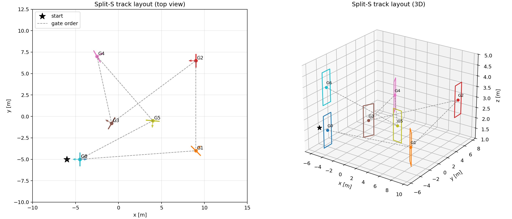

# 组会报告

## 1. 本周工作总结

本周围绕 AC-MPC 论文方法完成了从 Python 原型环境到 Flightmare 环境的复现链路建设。当前工作已经覆盖：

| 模块 | 完成内容 | 当前状态 |
|---|---|---|
| AC-MPC 原始代码理解 | 阅读论文方法、梳理 `MlpMpcPolicy`、可微 MPC、state plumbing、PPO 训练关系 | 已完成 |
| Python Gym 竞速环境 | 实现 gate 几何、track loading、四旋翼外部动力学、36 维 observation、13 维 state、reward/done | 已完成 |
| Gym PPO 训练 | 使用 AC-MPC policy 在水平赛道与 Split-S 赛道训练 | 已完成 |
| Gym 评估与绘图 | 实现 deterministic evaluation、轨迹 CSV、success/crash/lap time/velocity 指标、速度热力图 | 已完成 |
| MPVE 方法扩展 | 实现 MPVE PPO 训练脚本与训练实测 | 已完成 |
| Flightmare 环境改造 | 新增 modified Flightmare `RacingEnv`、配置文件、pybind `RacingEnv_v1` | 已完成 |
| Flightmare 编译 | Windows + Python 3.10 环境下生成 `flightgym.cp310-win_amd64.pyd` 并通过 smoke test | 已完成 |
| Flightmare PPO 训练 | 接入 `RacingEnv_v1` 到 SB3 VecEnv，完成水平赛道训练 | 已跑通 |
| Flightmare 评估与可视化 | 完成 Flightmare 模型评估、轨迹记录、速度热力图 | 已完成 |

核心结论：Python Gym 水平赛道和 Flightmare 水平赛道均已跑通 AC-MPC 的训练与推理闭环；Split-S 复杂赛道当前仍未训练成功，主要卡在前 2 个 gate 附近，后续需要 curriculum、轨道尺度、初始状态和 reward shaping 进一步调试。

## 2. 方法与工程链路

当前复现遵循论文中 AC-MPC 的核心结构：

```text
obs(36)
  -> neural cost map / critic
state(13)
  -> differentiable MPC initial state
neural cost + state
  -> MPC solve
  -> normalized action [thrust, wx, wy, wz]
environment step
  -> reward / done / next obs / next state
PPO update
```

其中：

| 数据 | 维度 | 作用 |
|---|---:|---|
| observation | 36 | 输入 MLP cost map 和 critic |
| state | 13 | 输入 MPC 内部动力学模型，作为当前状态 |
| action | 4 | 归一化 thrust/body-rate command |

Gym 和 Flightmare 使用同一套上层训练逻辑。差异在于：

| 部分 | Python Gym | Flightmare |
|---|---|---|
| 动力学 | Python 实现的四旋翼外部动力学 | C++ Flightmare dynamics |
| gate passing | Python 几何检测 | C++ `RacingEnv` |
| reward/done | Python 环境实现 | C++ `RacingEnv` |
| PPO / AC-MPC | 相同 | 相同 |
| 绘图与评估 | 相同格式 | 相同格式 |

## 3. Python Gym 仿真

### 3.1 环境实现

主要能力：

- 支持水平赛道、Split-S 赛道等 JSON track。
- observation 与论文保持一致：`o_quad=[v, R]`，`o_track=未来两个 gate 的四角相对位置`。
- action 使用论文描述的 collective thrust + body rates。
- reward 采用论文中 gate progress reward 形式：

```text
collision: -10
gate passed: +10
race finished: +10
otherwise: distance progress - 0.01 * ||omega||
```

### 3.2 Gym 水平赛道训练结果


实际训练步数：约 `192k` env steps。最近 100 个 episode 统计：

| 指标 | 数值 |
|---|---:|
| recent return mean | 33.06 |
| recent success rate | 0.99 |
| recent collision rate | 0.01 |
| recent gate index mean | 2.99 / 3 |
| recent episode length mean | 51.89 steps |


结论：水平赛道较简单，AC-MPC 在约 20 万环境步内已经形成稳定穿门策略。

### 3.3 Gym 水平赛道评估结果

评估设置：16 episodes，deterministic policy。

| 指标 | 数值 |
|---|---:|
| success rate | 1.00 |
| crash rate | 0.00 |
| return mean | 33.79 |
| average velocity | 6.32 m/s |
| average lap time | 1.005 s |
| final gate index mean | 3.00 / 3 |


结论：训练后的 deterministic policy 可以稳定完成三门水平赛道，轨迹集中，速度分布稳定。

### 3.4 MPVE 方法扩展

实际训练步数：约 `170k` env steps。最近 100 个 episode 统计：

| 指标 | 数值 |
|---|---:|
| recent return mean | 33.63 |
| recent success rate | 1.00 |
| recent collision rate | 0.00 |
| recent gate index mean | 3.00 / 3 |
| recent episode length mean | 41.04 steps |


结论：MPVE 版本在水平赛道上可以稳定训练，且最近 episode length 更短，说明策略速度更高或轨迹更直接。但当前只完成单次 run，尚不能作为严格统计结论；后续应进行相同 seed/多 seed 对照实验。

在训练过程中，由于选取的lambda=0.95，因此mpve方法仅在训练稳定性上有优势，但是训练速度并没有显著优化，与论文的结论一致

### 3.5 Gym Split-S 赛道设置

Split-S 赛道文件：

当前设计包含 7 个 gate，起点位于 `[-6, -5, 2]`，gate 高度和方向有明显变化，难度显著高于水平赛道。



### 3.6 Gym Split-S 当前训练结果

实际训练步数：约 `1.332M` env steps。最近 100 个 episode 统计：

| 指标 | 数值 |
|---|---:|
| recent return mean | 29.76 |
| recent success rate | 0.00 |
| recent collision rate | 0.88 |
| recent timeout rate | 0.12 |
| recent gate index mean | 2.25 / 7 |
| recent episode length mean | 256.94 steps |


评估设置：32 episodes，deterministic policy。

| 指标 | 数值 |
|---|---:|
| success rate | 0.00 |
| crash rate | 1.00 |
| return mean | 17.63 |
| average velocity | 15.65 m/s |
| final gate index mean | 1.50 / 7 |


结论：Split-S 当前尚未训练成功。训练曲线显示 reward 有上升，但 gate progress 停留在前几个 gate；评估中全部 crash，说明策略已经学到向前冲刺和部分 gate progress，但还没有学会稳定完成后续复杂转向和高度变化。下周将进一步完成复杂赛道的仿真验证。

## 4. Flightmare 环境仿真

Flightmare环境是论文中用到的更真实更通用的无人机仿真环境，以C++编写，相比于之前自己实现的环境更完善。

### 4.1 Flightmare 改造与编译

当前已完成：

- 新增 C++ `RacingEnv`。
- 新增 `racing_env.yaml`。
- 新增 pybind class `RacingEnv_v1`。
- 使用 rate-thrust command mode。
- 使用与 Gym 一致的 observation/action/state 维度。
- 不接入 Unity gate 可视化，采用 headless training/eval。

### 4.2 Flightmare 训练脚本

按同接口和同产出的标准，仿照gym环境写了Flightmare环境的训练脚本

### 4.3 Flightmare 水平赛道训练结果

当前 Flightmare 配置轨道为水平轨道

实际训练步数：约 `106k` env steps。注意：`config.json` 中的 `total_timesteps=10000000` 是计划训练步数，当前报告按实际日志统计。

最近 100 个 episode 统计：

| 指标 | 数值 |
|---|---:|
| recent return mean | 33.53 |
| recent success rate | 1.00 |
| recent collision rate | 0.00 |
| recent gate index mean | 3.00 / 3 |
| recent episode length mean | 64.97 steps |


结论：modified Flightmare 环境中，AC-MPC policy 已能在水平三门赛道上稳定训练成功；训练闭环、checkpoint、VecNormalize、评估加载均已跑通。

### 4.4 Flightmare 水平赛道评估结果

评估设置：16 episodes，deterministic policy。

| 指标 | 数值 |
|---|---:|
| success rate | 1.00 |
| crash rate | 0.00 |
| return mean | 34.07 |
| average velocity | 4.89 m/s |
| average lap time | 1.28 s |
| final gate index mean | 3.00 / 3 |


结论：Flightmare 评估结果稳定完成水平赛道。与 Gym 水平赛道相比，Flightmare 平均速度较低、lap time 较长，这符合两个环境动力学和动作响应不完全一致的预期。

## 5. 当前问题与后续计划

### 5.1 当前问题

1. Split-S 复杂赛道尚未训练成功，目前主要停留在前 2 个 gate 附近。
2. Flightmare 当前只完成水平赛道训练，尚未将 Split-S track 切换到 Flightmare 中训练。

### 5.2 后续计划

1. 对 Split-S 增加 curriculum：
   - 先训练前 1 个 gate
   - 再扩展到 2、3、4 个 gate
   - 最后训练完整 track

2. 调整复杂赛道训练设置：
   - 降低初期速度上限或提高 collision 惩罚
   - 增加初始位置扰动 curriculum
   - 检查 gate normal 和 gate 顺序
   - 检查 world bounds 是否过窄

3. 做严格 MPVE 对照：
   - same seed
   - same track
   - same total env steps
   - base AC-MPC vs MPVE AC-MPC
   - 至少 3 个 seed

4. 将 Split-S 迁移到 Flightmare：
   - 修改 `racing_env.yaml`
   - 先做 gate passing smoke test
   - 再做短训练和评估

## 6. 本周结论

本周完成了 AC-MPC 从论文代码理解、Python Gym 原型、PPO 训练、评估绘图、MPVE 扩展，到 modified Flightmare 环境改造、编译、训练和评估的完整工程链路。  

目前可稳定复现的是水平三门赛道：Gym 与 Flightmare 均达到 100% deterministic success rate。  

当前主要未解决问题是复杂 Split-S 赛道训练不足，后续应将重点放在 curriculum、赛道设置校验和 Flightmare Split-S 迁移上。